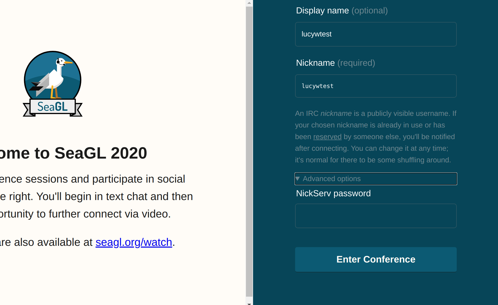

## IRC Basics

[This IRC Cheatsheet](https://gist.github.com/xero/2d6e4b061b4ecbeb9f99) Is a great, comprehensive,
quick read if you're looking for more information about IRC commands.

### The Basics
- `/join #channel`
  - Joins the specified channel.
- `/part #channel`
  - Leaves the specified channel.
- `/nick nickname`
  - Changes your "nick" or username.
- `/msg nickname message`
  - Sends a private message to a user.
- `/query nickname message`
  - Sends a private message to a user and opens a private chat window.

## Nick (aka Username) Management (NickServ)
All nickserv commands begin with `/ns` or `/msg NickServ`.

- `/ns register password [email]`
  - Registers your current nick with NickServ with the chosen password and binds it to an e-mail address (optional).
- `/ns identify password`
  - Identifies your nick to NickServ using the password you set. If you have a nick that's been registered, and you don't i
- `/ns recover nickname password`
  - Kills (forcibly disconnects) someone who has your registered nick.
- `/ns ghost nickname password`
  - Terminates a "ghost" IRC session that's using your nickname.
- `/ns set password yournewpassword`
  - Changes your password.

## Registering your Nick

We highly recommend that you register your nick so that you're able to log in as the same user and
reclaim your nick if it gets taken. You can see the commands above:

```
/ns register password [email]
```

You can then log in to KiwiIRC with your password under Advanced Options:


You can also log in without a password and use
```
/ns identify <mypassword>
```
to re-identify as your handle.

If someone has taken your handle you can use
```
/ns recover <nick> <mypassword>
```
to recover it.

You can read more about nick registration [in Freenode's
documentation](https://freenode.net/kb/answer/registration).
